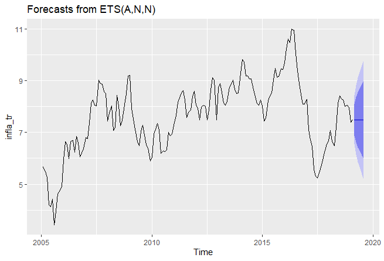

# Inflación
Inflacion en Uruguay

This repo shows how to treat series data in R, in order to make forecast, using different methods to be accurate as possible.

## Deployment

Uploade the file, data, and run R code

## Authors

* **[Raul Vila](https://www.linkedin.com/in/raulvila1/)** - *Initial work* - 

